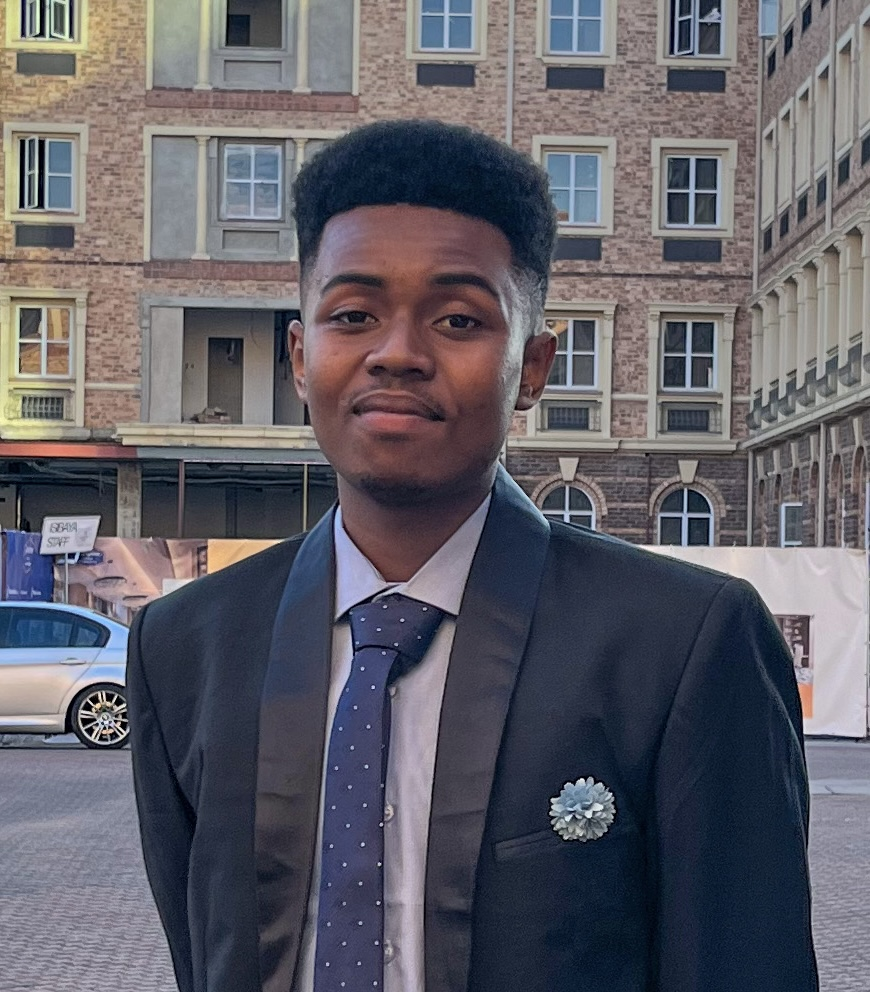

# 
 COS 214 Project : City Builder 

---
  
##  
 *Team 8 : Design Wits* 

---
# Contents:
- [Description](#description)
- [How to Run](#how-to-run)
- [Documentation](#documentation)
- [Team](#team)
### Description:
A sophisticated city simulation system demonstrating advanced software design patterns through urban management. Players become city planners, balancing four vital sectors: Residential, Commercial, Public Services, and Infrastructure. The system features dynamic building construction, citizen management with employment and satisfaction systems, comprehensive resource management, government policies, and transportation planning. Built using various design patterns including Factory Method, State, Observer, Command, Decorator, and Strategy patterns to ensure maintainable, scalable architecture.
### How to Run:
- Clone the repository: `git clone https://github.com/COS214-Project-2024/Team-8-Design-Wits.git`
- Change into project directory: `cd Team-8-Design-Wits`
- Navigate to System: `cd System`
- Build the project: `make`
- Run the program: `./citybuilder`
### Documentation:
- [Research Brief](Report/COS214_RESEARCH_BRIEF%20(2).pdf)
- [Design Documentation](Report/Design%20Wits.pdf)
- [API Documentation](doxygen/html/index.html)
### Team:
| Name | Links | Description |
|----------------|------|-------------|
| Tebogo Hamese  *u21532941*  |   |Computer Science student exploring cybersecurity and cloud computing. I keep my head in the clouds... but at least this way, I know they're secure!|
| Nevan Rahman *u21572993*  |    | BSc Computer Science student and IT Lab Technician with a passion for data. |
| Unathi Dlamini *u22553402*  |    |A second-year computer science student at the University of Pretoria with a passion for programming, web design, and learning new skills.|
| Palesa Thabane *u21540838*  |   | Shy shell-dweller BSc Computer Science student with an interest in cybersecurity. |
| Reinhard Pretorius *u22509578*  |   |Computer Science student with a passion for Machine Learning and Complex Data structures|
| Mthawelanga Gomba *u21664707*  | | Average dude doing what he can and having fun along the way.|
| Philemon Muleya *u23629810*  |   |Second year student with interest in operating systems. Sudo apt-get install Knowledge... Error|
